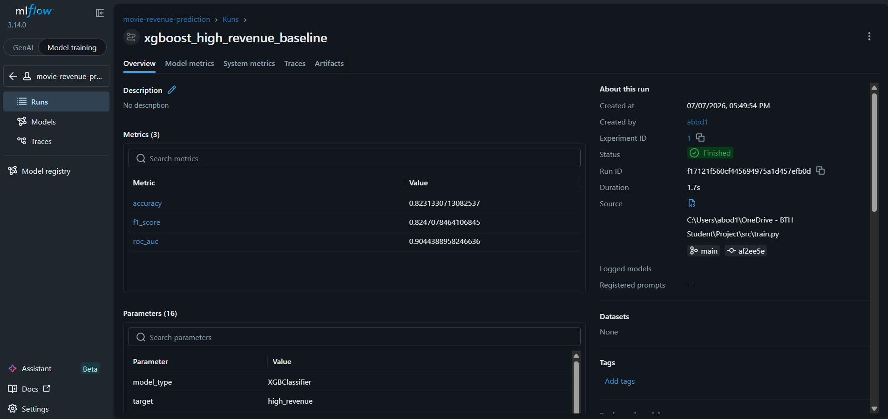
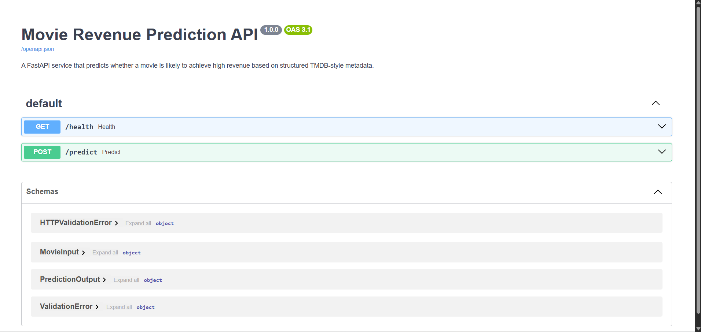
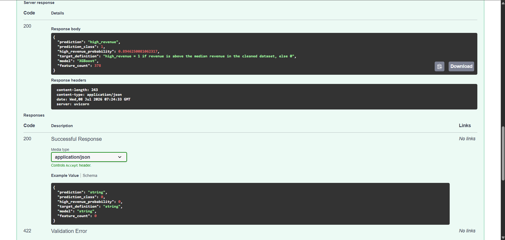
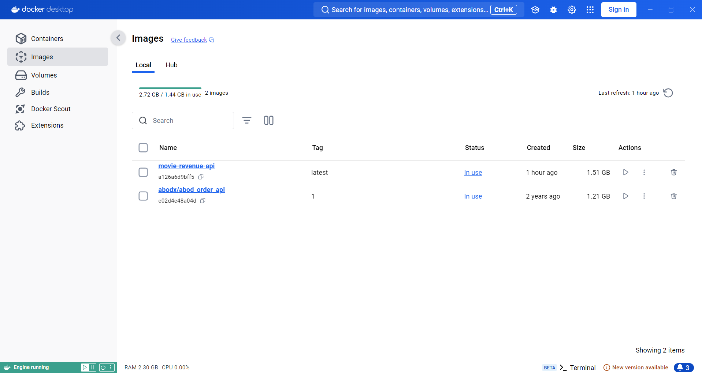

# Movie Revenue Prediction MLOps Pipeline

Production-style machine learning pipeline for predicting whether a movie is likely to achieve **high revenue** using structured TMDB-style metadata.

This project upgrades a notebook-based machine learning workflow into a reusable MLOps system with data cleaning, feature engineering, model training, MLflow experiment tracking, FastAPI inference, automated testing, Docker containerization, and a GitHub Actions CI/CD pipeline.

---

## Overview

The model predicts whether a movie's revenue is above the median revenue in the cleaned dataset.

```text
high_revenue = 1 if revenue > median_revenue
high_revenue = 0 otherwise
```

This is a binary classification task, not exact revenue regression.

---

## Tech Stack

- Python
- Pandas
- NumPy
- scikit-learn
- XGBoost
- MLflow
- FastAPI
- pytest
- Docker
- GitHub Actions
- GitHub Container Registry
- CI/CD

---

## Pipeline

```text
Raw TMDB data
→ Data cleaning
→ Feature engineering
→ Train/test split
→ XGBoost training
→ MLflow experiment tracking
→ Saved model artifacts
→ FastAPI prediction endpoint
→ Automated pytest tests
→ Docker image build
→ GitHub Actions CI/CD
→ GitHub Container Registry
```

---

## Model Performance

The XGBoost classifier was evaluated on a held-out test set.

| Metric | Score |
|---|---:|
| Accuracy | 0.823 |
| F1 Score | 0.825 |
| ROC-AUC | 0.904 |

---

## MLflow Experiment Tracking

The training script logs model parameters, metrics, and artifacts with MLflow.

Logged items include:

- Model type
- Target variable
- Accuracy
- F1 score
- ROC-AUC
- XGBoost hyperparameters
- Train/test size
- Number of features
- Saved model and preprocessing artifacts



---

## FastAPI Prediction API

Run the API locally:

```bash
uvicorn app.main:app --reload
```

Open the interactive API documentation:

```text
http://127.0.0.1:8000/docs
```



---

## Example Prediction

### Request

```json
{
  "budget": 50000000,
  "runtime": 120,
  "release_date": "2026-07-10",
  "adult": false,
  "original_language": "en",
  "genres": ["action", "adventure", "science fiction"],
  "production_companies": ["warner bros. pictures"],
  "spoken_languages": ["english"],
  "keywords": ["superhero", "based on comic"],
  "production_countries": ["united states of america"]
}
```

### Response

```json
{
  "prediction": "high_revenue",
  "prediction_class": 1,
  "high_revenue_probability": 0.8946,
  "target_definition": "high_revenue = 1 if revenue is above the median revenue in the cleaned dataset, else 0",
  "model": "XGBoost",
  "feature_count": 378
}
```



---

## Run Training

```bash
python -m src.train
```

This creates the trained model and preprocessing artifacts:

```text
models/revenue_model.joblib
models/feature_columns.json
models/top_100_companies.json
models/top_100_keywords.json
models/preprocessing.joblib
models/model_metadata.json
```

---

## Run MLflow

```bash
mlflow ui --backend-store-uri sqlite:///mlflow.db
```

Open:

```text
http://127.0.0.1:5000
```

---

## Run Tests

```bash
python -m pytest tests -v
```

The automated tests check:

- API health endpoint
- API prediction endpoint
- Feature preprocessing column consistency

---

## Docker

Build the Docker image:

```bash
docker build -t movie-revenue-api .
```

Run the container:

```bash
docker run -p 8000:8000 movie-revenue-api
```

Open:

```text
http://localhost:8000/docs
```



---

## CI/CD with GitHub Actions

The project includes a GitHub Actions workflow located at:

```text
.github/workflows/ci-cd.yml
```

The workflow runs automatically when code is pushed to the `main` branch or when a pull request targets `main`.

The CI/CD pipeline:

1. Checks out the repository
2. Sets up the Python environment
3. Installs project dependencies
4. Verifies the project imports
5. Runs the automated pytest test suite
6. Builds the Docker image
7. Publishes validated Docker images to GitHub Container Registry

The Docker build runs only after all automated tests pass.

```text
Code push or pull request
→ Install dependencies
→ Verify imports
→ Run pytest tests
→ Build Docker image
→ Publish validated image
```

For pull requests, the workflow tests the project and builds the Docker image without publishing it.

For pushes to `main`, the validated image is published to GitHub Container Registry.

Example image location:

```text
ghcr.io/aabb00dd/movie-revenue-prediction-mlops-pipeline:latest
```

This workflow provides:

- Continuous Integration through automated testing
- Continuous Delivery through automated Docker image publication
- Reproducible builds
- Early detection of integration and dependency errors

---

## Project Structure

```text
.github/
  workflows/
    ci-cd.yml

app/
  main.py

src/
  config.py
  data.py
  features.py
  predict.py
  train.py

tests/
  test_api.py
  test_features.py

models/
  revenue_model.joblib
  preprocessing.joblib
  feature_columns.json
  model_metadata.json

Dockerfile
requirements.txt
README.md
```

---

## Limitations

- The model predicts high vs low revenue, not exact revenue.
- The target is based on the median revenue of the cleaned dataset.
- Predictions depend on the quality and completeness of movie metadata.
- The dataset may contain noisy, missing, or inconsistent records.
- The CI/CD workflow publishes a Docker image but does not deploy the API to a live production environment.
- Trained model artifacts may need to be generated or mounted before predictions can be served.

---

## Future Improvements

- Deploy the API to a public cloud platform
- Add automated production deployment
- Add model registry support
- Add monitoring for data drift and prediction drift
- Add automated code-quality and security checks
- Compare additional models and tuned hyperparameters
````
